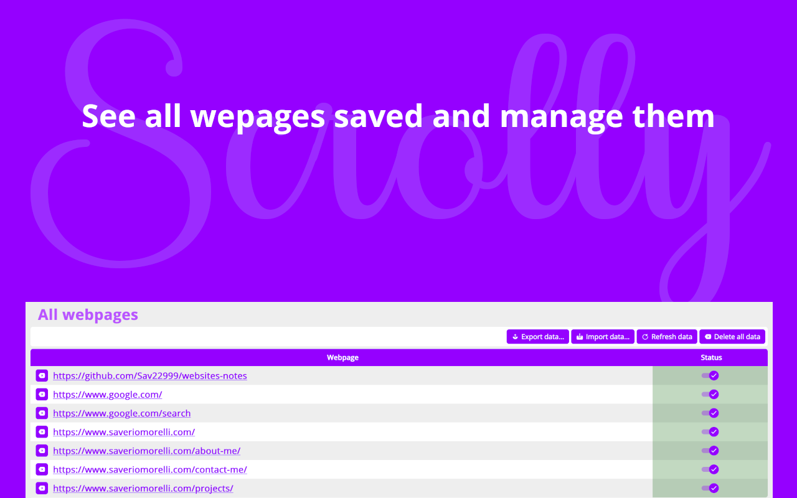

<h1 align="center">
     
    
     
    Scrolly
     
</h1>
Official repo of https://addons.mozilla.org/it/firefox/addon/scrolly/

  

 

To support me, you can do a donation :smile: with **LiberaPay** or **PayPal**:

 [</img>](https://paypal.me/saveriomorelli)

## Description

Remember the scroll position of each webpages.

You can disable/enable the addon on specific webpages and how you prefer.

## Features

- Enable/Disable the feature, based on your preferences and with a single click

## How to contribute

You can open an issue and there you must describe the feedback, the bug or the new feature you want.

## Screenshots

See folder <code>screenshots</code> to see screenshots also of the older versions.

</img></img></img>
